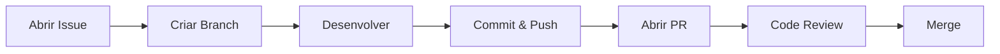

# Como contribuir

Obrigado por contribuir. Este guia resume o fluxo de trabalho do projeto.

## Fluxo de Trabalho



---

## 1. Abrir uma issue

Antes de começar, abra uma issue descrevendo o que vai fazer:

- `[BUG]` para problemas
- `[FEATURE]` para novas funcionalidades
- `[DOC]` para documentação

---

## 2. Criar uma branch

```bash
# Atualizar main
git fetch origin
git checkout main
git pull origin main

# Criar branch com nome descritivo
git checkout -b feature/descricao-da-feature

# Ou para bugs:
git checkout -b fix/descricao-do-bug
```

### Convenção de Nomes

```
feature/  - Nova funcionalidade
fix/      - Correção de bug
docs/     - Documentação
refactor/ - Refatoração
test/     - Testes
chore/    - Limpeza/manutenção
```

---

## 3. Desenvolver

### Boas práticas

- Escreva código limpo e legível.
- Comente código complexo.
- Faça commits pequenos e descritivos.
- Não faça commit de arquivos maiores que 5MB.
- Teste seu código antes de fazer push.

### Estrutura de Commits

```bash
# Formato:
git commit -m "tipo: descrição breve"

# Exemplos:
git commit -m "feat: adicionar validação de entrada"
git commit -m "fix: corrigir cálculo de impedância"
git commit -m "docs: atualizar guia de instalação"
git commit -m "refactor: simplificar função X"
```

---

## 4. Fazer push

```bash
# Push da sua branch
git push origin feature/sua-feature

# Ou se já existe:
git push origin feature/sua-feature --force-with-lease
```

---

## 5. Abrir um pull request

1. Vá para GitHub → Pull Requests
2. Clique em "New Pull Request"
3. Compare sua branch com `main`
4. O template aparecerá automaticamente

### Preencher o Template

```markdown
## Descrição
Descreva o que você fez.

## Tipo de Mudança
- [x] Bug fix
- [ ] Nova funcionalidade
- [ ] Melhoria
- [ ] Documentação

## Issues Relacionadas
Closes #123

## Testes
- [x] Teste A
- [x] Teste B

## Checklist
- [x] Código segue o estilo do projeto
- [x] Documentação atualizada
- [x] Sem arquivos desnecessários
```

---

## 6. Code review

- Colegas vão revisar seu código.
- Responda aos comentários e faça os ajustes necessários.

---

## 7. Merge

Após aprovação:

1. Clique em "Merge pull request"
2. Selecione "Squash and merge" (opcional)
3. Confirme
4. Delete a branch

---

## Regras importantes

### Limite de arquivo

Máximo de 5MB por arquivo. Para arquivos maiores, use links externos.

### Formato de código

Siga o estilo existente do projeto.

### O que evitar

- Não fazer commit direto em `main`.
- Não adicionar credenciais ou tokens.

---

## Ajuda

Abra uma issue com `[QUESTION]` ou consulte a [referência rápida](quick-reference.md).
